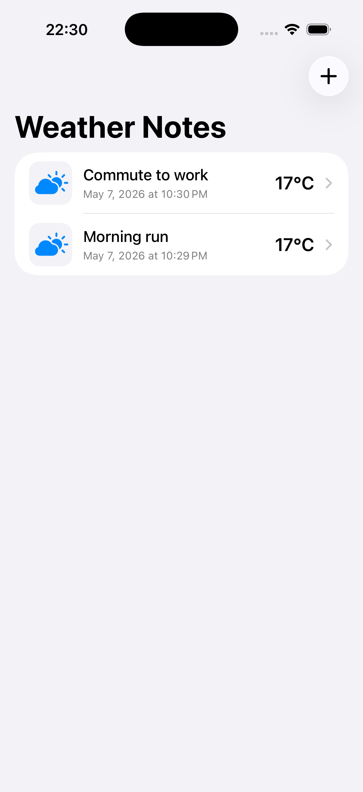
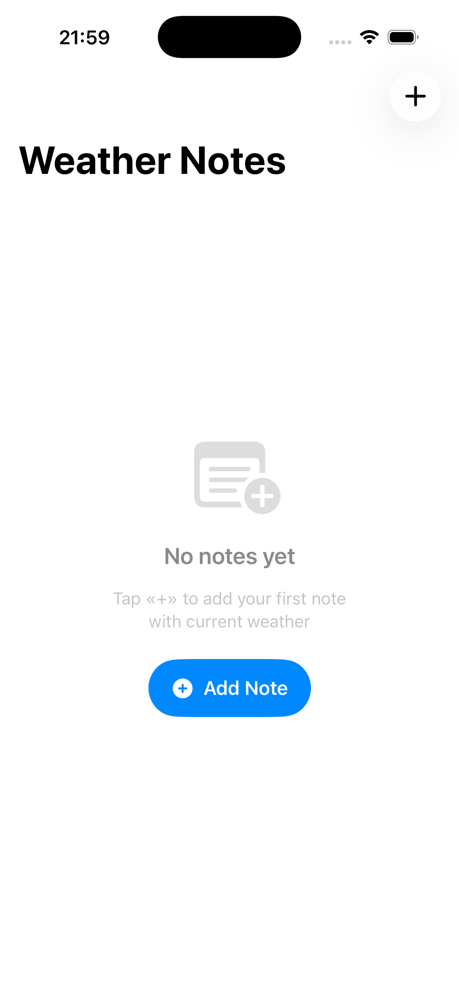
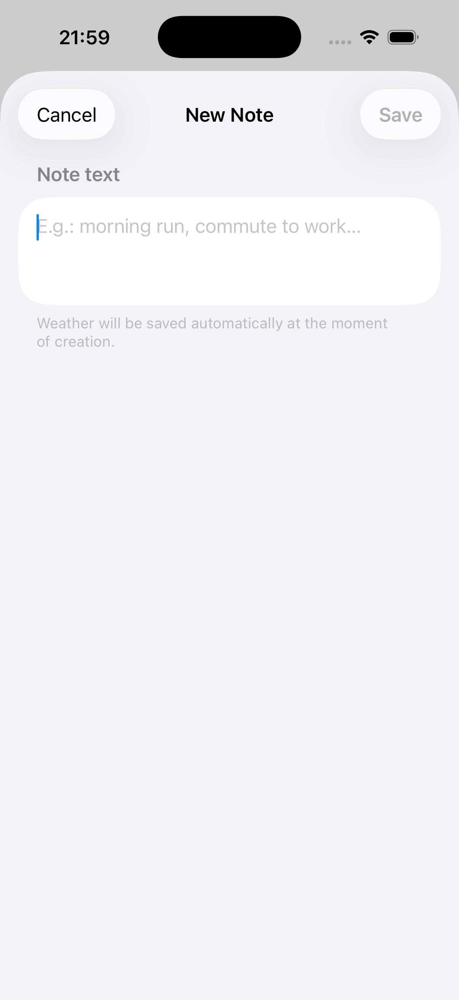
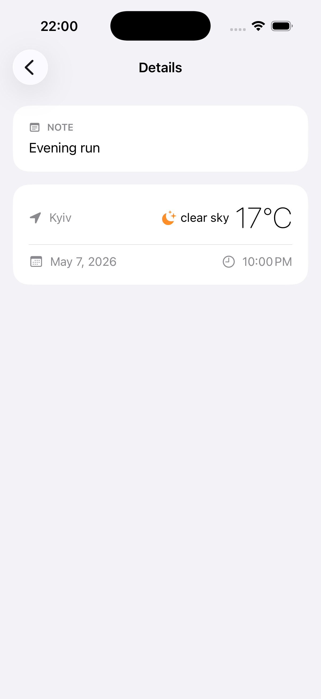

# WeatherNotes

iOS app for saving personal notes with current weather data automatically attached.

## Screenshots

| List | Empty State | Add Note | Detail |
|------|-------------|----------|--------|
|  |  |  |  |

## Features

- Add notes with weather snapshot (temperature, condition, location)
- Auto-fetch weather by GPS location
- List screen with weather icon and temperature
- Detail screen with full weather info
- Swipe to delete
- CoreData persistence
- Dark mode support

## Tech Stack

- Swift 5.9 / SwiftUI
- MVVM architecture
- CoreData (programmatic model, no .xcdatamodeld)
- URLSession + async/await
- CoreLocation
- NSFetchedResultsController
- OpenWeather API

## Setup

1. Clone the repo
2. Get a free API key at openweathermap.org/api
3. In WeatherService.swift replace YOUR_OPENWEATHER_API_KEY with your key
4. Build and run in Xcode 15+

## Requirements

- iOS 17+
- Xcode 15+
